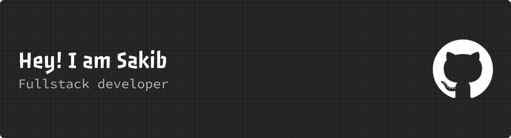

<!-- Banner Image -->

# 👋 Hi, I'm **Najmus Sakib**

💻 Frontend‑Focused Full‑Stack Developer (MERN) | 🎨 UI/UX‑Driven | 🚀 React & Next.js Enthusiast 

---

## 🧍‍♂️ About Me
I’m a passionate developer from Bangladesh who enjoys building clean, responsive, and user‑friendly web applications.

My core strength is frontend development with React and Next.js, where I focus on reusable components, performance, and polished UI using Tailwind CSS. I also work with the MERN stack to connect real products to real data.

I’m actively improving my fundamentals, learning best practices, and preparing myself for professional frontend / full‑stack roles.

---

## 🔭 What I’m Currently Doing
- 🚀 Building a **Blogging Platform** project using Next.js and Tailwind CSS  
- 🚀 Updating a **Tourism Website** project using React and Firebase 
- 🌐 Working on **eduCircle**, an assignment submission & evaluation platform  
- ⚡ Exploring **Next.js** and advanced component design patterns  

---

## 🛠️ Skills

### 🎨 Frontend

  

### 🔧 Tools & Platforms

  

---

## 🌐 Connect With Me

  
  
  

📱 **Phone:** +8801736007474

---

## 📊 GitHub Stats

  <!--  -->
  
    <!--  -->

  

---

### ✨ Fun Fact
> “I focus on building interfaces that feel simple, fast, and intuitive — because good UI is invisible when it’s done right.”  

---

